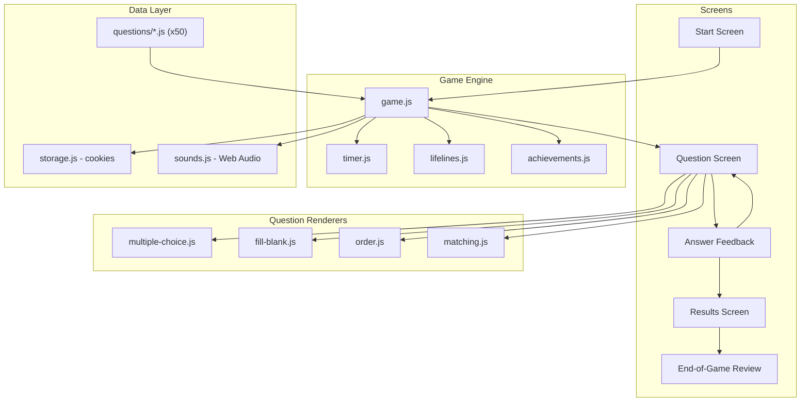

# ADR Trivia Game Plan

## Architecture

A static single-page app: **Vite** (vanilla JS) + **Tailwind CSS** (Play CDN). No backend. Deploys to GitHub Pages via GitHub Actions.




## Project Structure

```
lullabot-adrs-trivia/
  index.html
  vite.config.js
  src/
    main.js                 # Bootstrap, screen routing
    game.js                 # Core game engine (modes, scoring, streaks, lives)
    timer.js                # Countdown timer with speed scoring
    lifelines.js            # 50/50, Read ADR, Skip
    achievements.js         # Badge definitions and unlock logic
    storage.js              # Cookie read/write for all persistent state
    sounds.js               # Web Audio API: chime, buzz, beep, fanfare
    confetti.js             # Canvas confetti effect
    renderers/
      multiple-choice.js
      fill-blank.js
      order.js
      matching.js
    questions/
      index.js              # Auto-imports via import.meta.glob
      phpstan-level.js      # One file per question (x50)
      branch-naming.js
      avoid-jquery.js
      ...
  scripts/
    validate.js             # Question schema validator
  public/
    favicon.svg
  .github/
    workflows/
      deploy.yml
  package.json
  README.md
```

## Game Modes

### Classic Mode

- All questions (or filtered by category), shuffled
- 3 lives (hearts in header) -- wrong answer loses a heart, game over at 0
- No question limit -- play through all available questions until lives run out
- Final score shown at end

### Daily Challenge Mode

- 10 questions seeded by today's date (deterministic shuffle so everyone gets the same set)
- After completing 10, show score + shareable emoji grid:
`ADR Trivia 2026-03-25: 8/10 🟩🟩🟥🟩🟩🟩🟥🟩🟩🟩 🔥3 streak`
- "Copy to clipboard" button
- **"Keep Playing" button** continues with the remaining questions in relaxed mode (no lives, just for fun/learning)

## Start Screen

- Game title and brief tagline
- **Mode selector**: Classic / Daily Challenge (toggle buttons)
- **Category filter** (Classic only): checkboxes for Drupal, Front-end, DevOps, Composer, Git, General -- default all selected
- **Stats bar**: "You've mastered 32 of 50 questions" with a progress ring
- **Achievements grid**: earned badges displayed as icons, unearned ones greyed out
- "Start Game" button

## Question Screen

### Countdown Timer

- 20-second countdown bar at the top, shrinks left to right
- Bar color shifts from green to yellow (10s) to red (5s)
- **Last 10 seconds**: a soft beep every second via Web Audio, increasing in pitch
- Points scale with remaining time: `basePoints * (timeLeft / totalTime)` -- faster = more points
- If timer runs out: treated as wrong answer (lose a life in Classic mode)

### Streak System

- Consecutive correct answers build a streak: shown as "🔥 x3" near the score
- Streak multiplier on points: x1 (1-2 streak), x2 (3-4), x3 (5-6), x4 (7+)
- Breaking a streak plays a distinct sound and resets multiplier
- Streak count shown prominently with a pulse animation on increment

### Lifelines (shown as 3 buttons below the question)

- **50/50** (1 per game): Removes two wrong options. Only works on multiple-choice and fill-blank types. Button shows a circle-half icon.
- **Read the ADR** (1 per game): Opens the source ADR link in a new tab. The question remains answerable. No point penalty but no timer pause.
- **Skip** (2 per game): Skips to the next question. Recorded as "skipped" (not wrong -- no life lost). Shown in the end-of-game review with a distinct color.

### Lives Display (Classic mode)

- 3 heart icons in the header, filled red
- Losing a life: heart empties with a brief shake animation
- At 1 heart remaining: hearts pulse as a warning
- At 0: game over screen with final score

### Score Display

- **Animated score counter**: digits roll up smoothly when points are added (CSS counter animation or requestAnimationFrame)
- Current score shown in header alongside streak and lives

## Question Renderers

Each renderer in `src/renderers/` receives the question data and calls back with the user's answer:

- **multiple-choice.js** -- 4 button cards in a 2x2 grid. On click: immediately submit. Supports 50/50 (hides 2 options).
- **fill-blank.js** -- Sentence with inline `<select>` dropdown + "Confirm" button. Supports 50/50.
- **order.js** -- Draggable cards (HTML Drag and Drop API + touch support via pointer events). "Lock In" button to submit.
- **matching.js** -- Two columns. Click left item, then right item to pair them (SVG lines drawn between). "Confirm" button when all paired.

## Answer Feedback

- **Correct**: option highlights green, play ascending chime, flash a random positive emoji (e.g. "Nailed it! 🎯"), show points earned with streak multiplier breakdown, show explanation + "Read the ADR" link
- **Wrong**: option highlights red, correct option highlights green, play low buzz, **screen shake** (CSS `translate` keyframe, ~100ms), show explanation + link
- **Skipped**: show explanation with "You skipped this one" note, distinct yellow/neutral highlight
- "Next Question" button to proceed

## Results Screen

- Large animated score with rank label (e.g. "ADR Expert!", "Getting There", "Rookie")
- Stats: questions correct / total, streak high, time taken, lifelines used
- **Skipped questions** listed separately (count + "Review these below")
- In Daily Challenge: shareable emoji grid + "Copy" button
- **Confetti canvas burst** on perfect score + fanfare sound
- Buttons: "Review Answers" / "Play Again" / "Back to Start"

## End-of-Game Review

- Scrollable list of all questions from the game
- Each shows: question text, your answer, correct answer, explanation, ADR link
- Color-coded: green (correct), red (wrong), yellow (skipped)
- Filterable tabs: All / Wrong / Skipped

## Achievements

Stored in the cookie, displayed on the start screen as a badge grid:

- **First Steps** -- Complete your first game
- **On Fire** -- Reach a 5-answer streak
- **Unstoppable** -- Reach a 10-answer streak
- **Drupal Guru** -- Answer all Drupal questions correctly (across games)
- **Front-end Wizard** -- Answer all Front-end questions correctly
- **Speed Demon** -- Finish a 10-question game in under 90 seconds
- **Perfect Game** -- 100% score in a game with 10+ questions
- **Scholar** -- Use "Read the ADR" lifeline 5 times (learning is the goal!)
- **Survivor** -- Win a Classic game with 1 heart remaining
- **Completionist** -- Answer all 50 questions correctly (across games)

## Question Format (one file per question)

All types share: `id`, `type`, `category`, `question`, `explanation`, `source`.

```js
// Type A: multiple-choice
export default {
  id: "phpstan-level",
  type: "multiple-choice",
  category: "drupal",
  question: "At what PHPStan level should all new PHP code be compliant?",
  options: ["Level 4", "Level 5", "Level 6", "Level 8"],
  correctIndex: 2,
  explanation: "Lullabot mandates PHPStan level 6...",
  source: "https://architecture.lullabot.com/adr/20260320-use-phpstan/"
};

// Type B: fill-blank
export default {
  id: "css-logical-margin",
  type: "fill-blank",
  category: "frontend",
  question: "Use ___ instead of `margin-left` when writing directional CSS.",
  options: ["margin-inline-start", "margin-block-start", "padding-inline-start", "margin-logical-left"],
  correctIndex: 0,
  explanation: "CSS Logical Properties replace directional terms...",
  source: "https://architecture.lullabot.com/adr/20220622-use-css-logical-properties/"
};

// Type C: order
export default {
  id: "drupal-build-order",
  type: "order",
  category: "drupal",
  question: "Put these Drupal build steps in the correct order:",
  items: ["drush updatedb", "drush config:import", "drush deploy:hook", "drush cache:rebuild"],
  correctOrder: [0, 1, 2, 3],
  explanation: "The canonical build order ensures DB updates run before config import...",
  source: "https://architecture.lullabot.com/adr/20230929-drupal-build-steps/"
};

// Type D: matching
export default {
  id: "tool-purpose-match",
  type: "matching",
  category: "general",
  question: "Match each tool to its purpose:",
  left: ["DDEV", "Renovate", "PHPStan", "Claro"],
  right: ["Local development", "Dependency updates", "Static analysis", "Admin theme"],
  correctPairs: [[0, 0], [1, 1], [2, 2], [3, 3]],
  explanation: "Each tool serves a specific role in the Lullabot stack...",
  source: "https://architecture.lullabot.com/adrs/"
};
```

Auto-discovered via `import.meta.glob` in `src/questions/index.js` -- contributors just add a file.

## Sound Effects (`src/sounds.js`)

All generated via **Web Audio API** (zero external files):

- **Correct chime**: ascending two-tone (C5 to E5, ~200ms)
- **Wrong buzz**: low-frequency detuned tone (A3, ~300ms)
- **Countdown beep**: short sine pulse, last 10 seconds, pitch rises each second
- **Streak sound**: quick ascending arpeggio on streak increment
- **Confetti fanfare**: bright major chord burst on perfect score
- **Life lost**: descending two-tone (E4 to C4)

## Cookie Storage (`src/storage.js`)

JSON-encoded cookie `adrs_trivia` (365-day expiry):

```js
{
  totalGames: 3,
  totalCorrect: 42,
  totalAnswered: 60,
  bestStreak: 7,
  history: { "phpstan-level": true, "branch-naming": false, ... },
  achievements: ["first-steps", "on-fire"],
  dailyChallenge: { "2026-03-25": { score: 8, grid: "🟩🟩🟥🟩🟩🟩🟥🟩🟩🟩" } }
}
```

## Styling

- **Tailwind Play CDN** -- zero CSS build step
- Modern, card-based centered layout, max-w-2xl container
- Inter / system font stack via Tailwind config
- Color palette: Lullabot-inspired teal/slate dark theme, green for correct, red for wrong, yellow for skipped
- Timer bar with gradient color transitions
- Heart icons with pulse/shake animations
- Achievement badges as icon grid (grey when locked, colored when earned)
- Responsive: stacks to single column on mobile
- Transitions: option hover scale, answer reveal fade, score counter roll-up

## Fun Polish

- **Confetti** (`src/confetti.js`): Canvas-based particle burst on perfect score
- **Screen shake**: CSS keyframe on wrong answer (~100ms translateX jitter)
- **Emoji feedback**: Random positive emoji on correct ("🎯", "🔥", "💡", "✨"), grimace on wrong ("😬", "💔")
- **Animated score counter**: digits roll up via requestAnimationFrame

## GitHub Pages Deployment

- `vite.config.js`: `base: '/lullabot-adrs-trivia/'`
- `.github/workflows/deploy.yml`: on push to main, checkout, npm ci, npm run build, deploy-pages
- Free for public repos

## README.md

- Project description and live demo link
- How to run locally: `npm install && npm run dev`
- How to build: `npm run build`
- How to contribute a question: file format, naming, validation (`npm run validate`)
- Game features overview
- Credits and CC-BY 4.0 license (matching Lullabot's ADR license)

